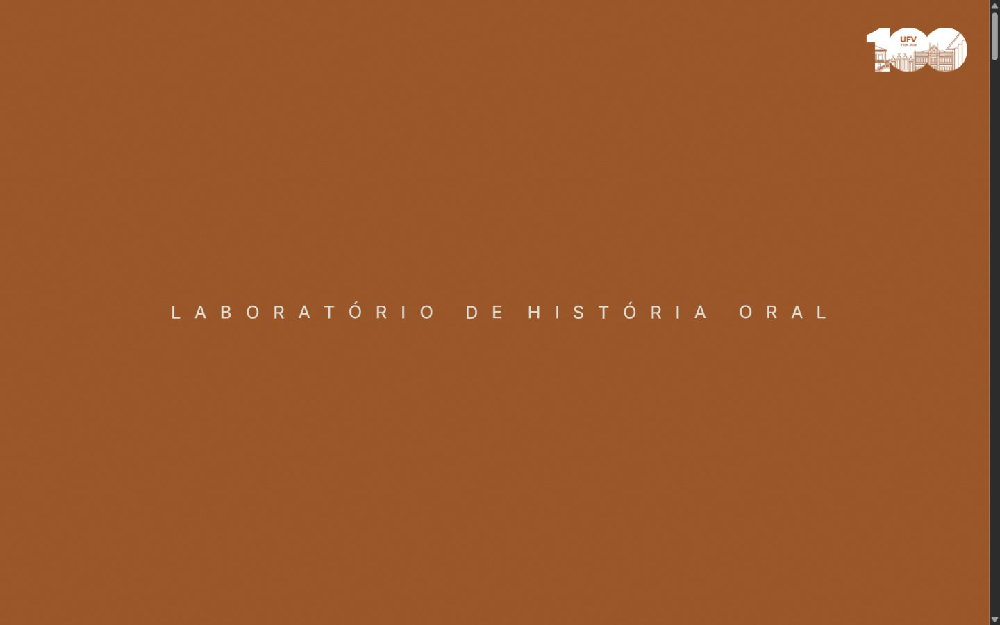
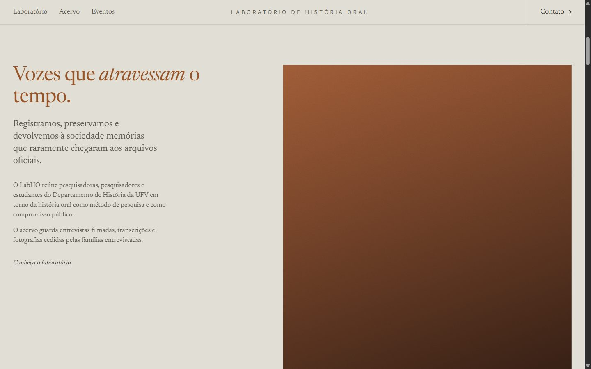
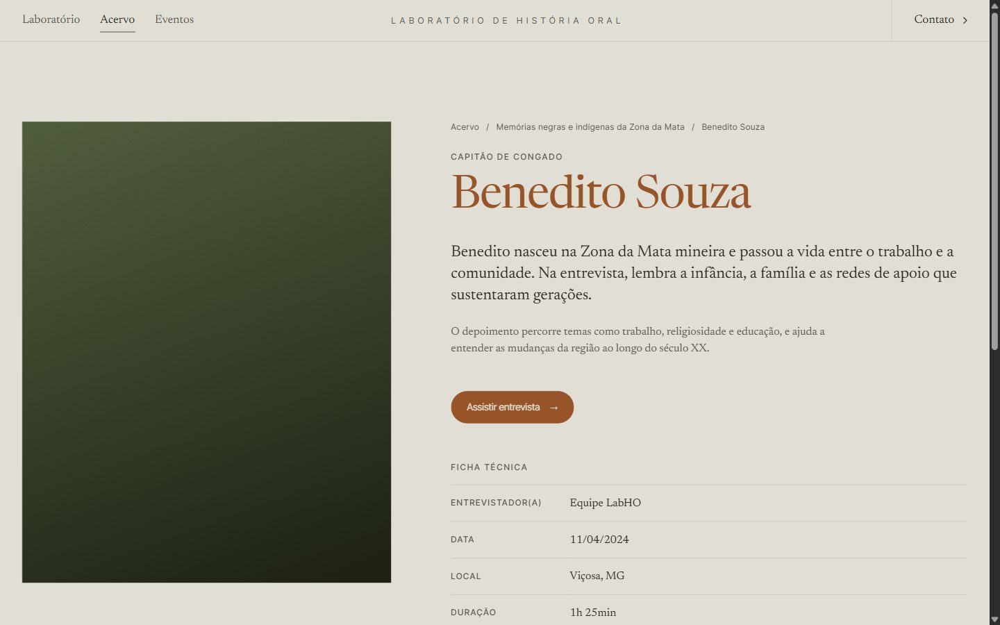
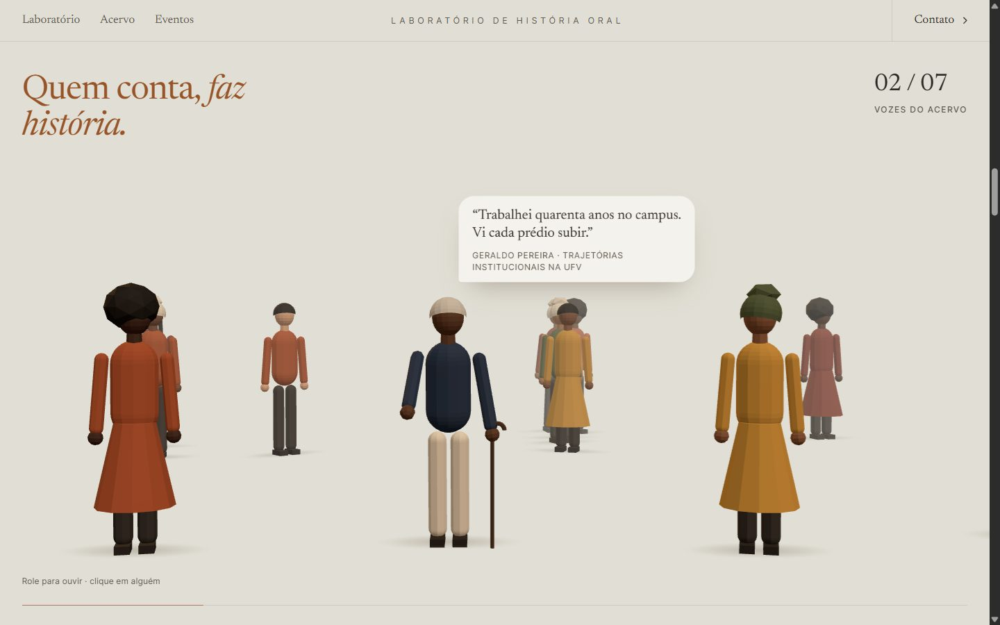
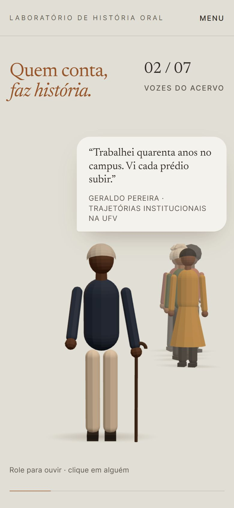

# LabHO — Laboratório de História Oral

Tema WordPress e protótipo do site do Laboratório de História Oral do Departamento de História da Universidade Federal de Viçosa (UFV): um acervo público de entrevistas com pessoas negras e indígenas da Zona da Mata mineira e com quem construiu a universidade.

**Protótipo:** [prototipo-historiaoral.vercel.app](https://prototipo-historiaoral.vercel.app) · **Painel WordPress ao vivo:** [abrir no WordPress Playground](https://playground.wordpress.net/?blueprint-url=https://raw.githubusercontent.com/rafaelcaetite/labho-historia-oral/main/dev/playground.json)



---

## Contexto

O laboratório precisava de um site que a própria equipe pudesse alimentar ao longo dos anos (entrevistas, projetos, eventos), sem depender de desenvolvedor. A estrutura de conteúdo segue o acervo de história oral do [CPDOC/FGV](https://cpdoc.fgv.br/acervo/historia-oral): projetos com as abas *Apresentação* e *Entrevistas*, busca por nome, filtro de A a Z e uma página por entrevista com vídeo, transcrição e ficha técnica. A linguagem visual parte do site da [The Reach](https://thereach.travel/).

Por isso a entrega é um **tema WordPress sob medida**, sem construtor visual nem plugins. A equipe edita tudo no painel, e o protótipo publicado é gerado a partir desse mesmo tema.

## Direção de arte

| | |
|---|---|
|  |  |

- **Abertura.** Laranja chapado (`#975428`) com o nome do laboratório em caixa alta espaçada. Ao rolar, o nome encolhe e vai para o centro do cabeçalho fixo. O cabeçalho vira a assinatura do site, e o banner não compete com o conteúdo.
- **Paleta.** Fundo areia (`#E1DFD5`), títulos em laranja e texto em tons de pedra. O cinza da referência (`#6C655A`) dá 4,2:1 sobre a areia, abaixo do mínimo AA, então o texto secundário foi escurecido para `#5C564C` (5,4:1).
- **Tipografia.** Serifa de leitura para títulos e texto corrido (Newsreader), sem serifa espaçada para rótulos e o wordmark (Inter Tight). A referência usa Bradford LL e TWK Everett, que são fontes pagas. As variáveis `--serif` e `--sans` já dão prioridade a elas, caso a licença seja adquirida.
- **Movimento.** Títulos entram palavra por palavra, blocos sobem com fade e a rolagem é suavizada (Lenis). Tudo é desligado com `prefers-reduced-motion`.
- **Imagens.** Enquanto um item não tem foto, aparece um degradê com grão no lugar. O layout nunca quebra por falta de imagem.

## A cena "Vozes do acervo"



Abaixo da abertura, uma fileira de pessoas em low-poly (maioria preta e parda, algumas idosas com bengala, poucas brancas) conversa enquanto a página rola:

- a câmera anda de pessoa em pessoa e para em cada uma;
- quem fala gesticula e olha para a câmera, e os outros viram a cabeça para quem fala;
- a fala aparece num balão, letra por letra. Ao passar o cursor sobre outra pessoa, ela acena e mostra o balão de "digitando";
- clicar ou tocar em alguém leva até essa pessoa. Clicar em quem está falando abre a entrevista.

As falas vêm do campo **Fala em destaque** de cada entrevista no painel, então a cena muda conforme o acervo cresce. Os balões são HTML projetado a partir da posição 3D das cabeças: o texto fica nítido, selecionável pelo leitor de tela (via `aria-live`) e estilizado pelo mesmo CSS do resto do site.

Alguns detalhes de implementação:
- A área de hover de cada pessoa é uma elipse invisível e fixa, e não a malha animada. Isso evita que o braço, ao acenar, saia de baixo do cursor e cancele o próprio aceno.
- Cada balão guarda o modo em que estava (fala ou digitando) durante o fade-out, para não mostrar o conteúdo do outro modo enquanto some.
- O posicionamento usa a propriedade CSS `translate`, e não `transform`, para que o `scale` do balão não encurte o deslocamento.
- O renderizador só roda com a seção visível na tela (`IntersectionObserver`). Sem WebGL, as falas aparecem como texto.

| | |
|---|---|
|  |  |

## Arquitetura

```
.
├── theme/labho/              Tema WordPress (o que vai para produção)
│   ├── functions.php         Tipos de conteúdo, campos, helpers de template, SEO, assets
│   ├── header.php            Abertura (só na home) e cabeçalho fixo
│   ├── front-page.php        Home: introdução, vozes, galeria, projetos, agenda
│   ├── archive-*.php         Listas: acervo (projetos) e eventos
│   ├── single-*.php          Projeto (abas + busca), entrevista, evento
│   ├── page-*.php            Sobre (Quem somos/Produções) e Contato
│   └── assets/
│       ├── css/main.css      Todo o CSS, organizado por seção, com tokens em :root
│       └── js/
│           ├── app.js        Comportamentos da interface (módulo ES)
│           └── scene.js      Cena 3D das vozes (carregada só na home)
├── dev/
│   ├── blueprint.json        WordPress local via Playground (PHP 8.3, pt-BR)
│   ├── playground.json       Painel ao vivo no playground.wordpress.net
│   └── seed.php              Conteúdo de demonstração (fictício)
├── scripts/
│   ├── build-demo.mjs        Gera o protótipo estático a partir do WordPress local
│   └── package-theme.mjs     Gera dist/labho.zip para instalar o tema
└── docs/
    ├── guia-editorial.md     Instalação e manual para a equipe do laboratório
    └── screenshots/
```

### Modelo de conteúdo

| Tipo | Endereço | Campos próprios |
|---|---|---|
| Projeto | `/acervo/`, `/acervo/{projeto}/` | título, resumo, apresentação (conteúdo), imagem, ordem |
| Entrevista | `/entrevista/{nome}/` | projeto, fala em destaque, link do YouTube, PDF da transcrição, ficha técnica |
| Evento | `/eventos/`, `/eventos/{evento}/` | data, local, gravação, pasta de certificados |
| Produção | (lista em `/laboratorio/`) | tipo, link |

Os campos usam meta boxes nativas (`_labho_*`), sem dependência de plugins como o ACF. As galerias usam o bloco **Galeria** do próprio editor: o tema lê os IDs das imagens e desenha a grade ou o carrossel. Assim a equipe não precisa aprender nenhum campo novo para fotos.

### Fluxo

1. O WordPress renderiza HTML semântico completo. O site funciona e é indexável sem JavaScript.
2. `app.js` (módulo ES) acrescenta a rolagem suave, as revelações, o menu móvel, a busca e o filtro A–Z, as abas e o vídeo em pop-up.
3. Na home, `app.js` importa `scene.js` sob demanda. As falas chegam como JSON embutido na página (`#vozes-data`), gerado pelo PHP.
4. Three.js e Lenis vêm por *importmap* a partir do jsDelivr, com versões fixas. Não há etapa de build.

## Desenvolvimento

Requer Node 20 ou mais novo. Não é preciso instalar PHP nem banco de dados: o [WordPress Playground](https://wordpress.github.io/wordpress-playground/) roda o WordPress em WebAssembly.

```bash
npm run dev          # WordPress em http://127.0.0.1:9400 com o tema montado e conteúdo de demonstração
npm run package      # gera dist/labho.zip para instalar em qualquer WordPress
```

As alterações em `theme/labho/` aparecem ao recarregar a página. O conteúdo de demonstração é recriado a cada execução.

### Painel ao vivo

O link **Painel WordPress ao vivo**, no topo, abre um WordPress completo no navegador, já logado como administrador. O [`dev/playground.json`](dev/playground.json) instala o tema direto da branch `main` deste repositório e roda o mesmo `seed.php` do ambiente local. Cada visitante recebe uma instância própria e descartável: nada fica salvo nem afeta outras pessoas, e o primeiro carregamento leva de 20 a 40 segundos.

## Protótipo estático e deploy

A Vercel não executa PHP, então o protótipo publicado é uma cópia estática do site renderizado pelo tema:

```bash
npm run demo:serve   # WordPress de demonstração em :9401 (sem login)
npm run demo:build   # percorre o site e grava HTML + assets em demo/
npm run deploy       # publica demo/ na Vercel
```

O `build-demo.mjs` segue todos os links internos e baixa os assets referenciados (inclusive o `import()` dinâmico da cena 3D). Ele remove metadados que só funcionam com o WordPress rodando (API REST, oEmbed) e grava uma `404.html`. Como o HTML é o do próprio tema, o protótipo não tem templates duplicados.

## Qualidade

Verificado em 360, 390, 768, 1024, 1366 e 1920 px de largura, nas 9 páginas-modelo:

- sem rolagem horizontal nem elementos vazando da tela;
- alvos de toque de pelo menos 24 × 24 px (WCAG 2.2 AA), com a navegação principal a 44 px;
- texto com pelo menos 12 px (exceto o wordmark, que funciona como logotipo);
- um `h1` por página, títulos sem pular nível e imagens com texto alternativo;
- contraste AA nos textos, foco visível, link para pular ao conteúdo, menu que fecha com Esc;
- `prefers-reduced-motion` respeitado em todas as animações;
- nenhum erro de PHP ou de console;
- PHP compatível com a versão 7.4, e todo conteúdo dinâmico sai escapado (`esc_html`, `esc_url`, `esc_attr`, `wp_json_encode`).

## Limitações conhecidas

- **Fontes.** As fontes da referência são pagas. O tema usa as alternativas gratuitas mais próximas.
- **CDN.** Three.js e Lenis dependem do jsDelivr. Se a rede institucional bloquear CDNs, basta copiar os dois arquivos para o tema e trocar as URLs do importmap em `functions.php`.
- **Conteúdo.** O protótipo usa nomes, falas e datas fictícios, e fotos substituídas por degradês.

## Licença

GPL-2.0-or-later, como exigido para temas WordPress. Veja [LICENSE](LICENSE). As logos da UFV pertencem à universidade.
